<div align="center">

<!-- ═══════════════════════════════════════════════════════════════════════ -->
<!-- HEADER -->
<!-- ═══════════════════════════════════════════════════════════════════════ -->


# 🧠 Cognitive Version Control

### *Git for the AI Mind*

**Save. Branch. Rewind. Merge. — Your AI agent just got an undo button.**

<br>

```bash
# macOS / Linux / WSL
curl -fsSL https://jaimeena.com/cvc/install.sh | bash

# Windows PowerShell
irm https://jaimeena.com/cvc/install.ps1 | iex
```

<br>

[](https://pypi.org/project/tm-ai/)
[](https://opensource.org/licenses/MIT)
[](https://www.python.org/)
[](https://github.com/mannuking/AI-Cognitive-Version-Control)
[](http://makeapullrequest.com)

[](https://github.com/mannuking/AI-Cognitive-Version-Control/stargazers)
[](https://github.com/mannuking/AI-Cognitive-Version-Control/network/members)
[](https://github.com/mannuking/AI-Cognitive-Version-Control/issues)

<br>

[🤖 Agent CLI](#-cvc-agent--your-own-ai-coding-assistant) · [✨ Features](#-the-problem-were-solving) · [🚀 Quick Start](#-get-started) · [📖 CLI Reference](#-cli-reference) · [🤝 Contributing](#-contributing)

</div>

<br>

---

<br>

<div align="center">

### Your AI coding agent is brilliant — for about 20 minutes.

Then it forgets what it already fixed, contradicts its own plan,
and loops on the same error for eternity.

***Sound familiar?***

</div>

<br>

---

## 🧠 What Is This?

**CVC** gives AI coding agents something they've never had: **memory management** that actually works.

> **Git, but for the AI's brain.**
> Instead of versioning source code, CVC versions the agent's *entire context* — every thought, every decision, every conversation turn — as an immutable, cryptographic Merkle DAG.

The agent can **checkpoint** its reasoning, **branch** into risky experiments, **rewind** when stuck, and **merge** only the insights that matter.

<br>

<div align="center">

<table>
<thead>
<tr>
<th align="center">💾 Save</th>
<th align="center">🌿 Branch</th>
<th align="center">🔀 Merge</th>
<th align="center">⏪ Rewind</th>
</tr>
</thead>
<tbody>
<tr>
<td align="center">Checkpoint the agent's brain at any stable moment.</td>
<td align="center">Explore risky ideas in isolation. Main context stays clean.</td>
<td align="center">Merge <em>learnings</em> back — not raw logs. Semantic, not syntactic.</td>
<td align="center">Stuck in a loop? Time-travel back instantly.</td>
</tr>
</tbody>
</table>

</div>

<br>

---

## 🤖 CVC Agent — Your Own AI Coding Assistant

<div align="center">

### **Claude Code on steroids — with Time Machine built in.**

Just type `cvc` and you're in. No setup menus, no extra commands.

<br>

```
cvc
```

<br>

That's it. One command. The agent launches.

</div>

<br>

CVC ships with a **full agentic coding assistant** directly in your terminal — like Claude Code, but with the ability to **save, branch, rewind, and search** through your entire conversation history. It's not just an AI chat — it's an AI with **cognitive version control**.

<br>

### 🔧 17 Built-in Tools

The agent has access to powerful tools that let it work directly on your codebase:

<div align="center">

<table>
<thead>
<tr>
<th width="10%">Icon</th>
<th width="25%">Tool</th>
<th width="65%">What It Does</th>
</tr>
</thead>
<tbody>
<tr><td align="center">📖</td><td><code>read_file</code></td><td>Read files with optional line ranges for large files</td></tr>
<tr><td align="center">✏️</td><td><code>write_file</code></td><td>Create or overwrite files, auto-creates directories</td></tr>
<tr><td align="center">🔧</td><td><code>edit_file</code></td><td>Precise find-and-replace edits with uniqueness validation</td></tr>
<tr><td align="center">🩹</td><td><code>patch_file</code></td><td>Apply unified diff patches (more robust than edit_file)</td></tr>
<tr><td align="center">🖥️</td><td><code>bash</code></td><td>Run shell commands (PowerShell on Windows, bash on Unix)</td></tr>
<tr><td align="center">🔍</td><td><code>glob</code></td><td>Find files by pattern (<code>**/*.py</code>, <code>src/**/*.ts</code>)</td></tr>
<tr><td align="center">📝</td><td><code>grep</code></td><td>Search file contents with regex + include filters</td></tr>
<tr><td align="center">📁</td><td><code>list_dir</code></td><td>List directory contents to explore project structure</td></tr>
<tr><td align="center">🌐</td><td><code>web_search</code></td><td>Search the web for docs, APIs, and error solutions</td></tr>
<tr><td align="center">📊</td><td><code>cvc_status</code></td><td>Show current branch, HEAD, and context state</td></tr>
<tr><td align="center">📜</td><td><code>cvc_log</code></td><td>View commit history — snapshots of the conversation</td></tr>
<tr><td align="center">💾</td><td><code>cvc_commit</code></td><td>Save a checkpoint of the current conversation state</td></tr>
<tr><td align="center">🌿</td><td><code>cvc_branch</code></td><td>Create a branch to explore alternatives safely</td></tr>
<tr><td align="center">⏪</td><td><code>cvc_restore</code></td><td>Time-travel back to any previous conversation state</td></tr>
<tr><td align="center">🔀</td><td><code>cvc_merge</code></td><td>Merge insights from one branch into another</td></tr>
<tr><td align="center">🔎</td><td><code>cvc_search</code></td><td>Search commit history for specific topics or discussions</td></tr>
<tr><td align="center">📋</td><td><code>cvc_diff</code></td><td>Compare conversation states between commits</td></tr>
</tbody>
</table>

</div>

<br>

### ⌨️ Slash Commands

While chatting with the agent, use these slash commands for quick actions:

<div align="center">

<table>
<thead>
<tr>
<th width="30%">Command</th>
<th width="70%">Description</th>
</tr>
</thead>
<tbody>
<tr><td><code>/help</code></td><td>Show all available slash commands</td></tr>
<tr><td><code>/status</code></td><td>View branch, HEAD, context size, provider & model</td></tr>
<tr><td><code>/log</code></td><td>Show last 20 conversation checkpoints</td></tr>
<tr><td><code>/commit &lt;msg&gt;</code></td><td>Save a manual checkpoint of the conversation</td></tr>
<tr><td><code>/branch &lt;name&gt;</code></td><td>Create and switch to a new conversation branch</td></tr>
<tr><td><code>/restore &lt;hash&gt;</code></td><td>Time-travel back to a specific checkpoint</td></tr>
<tr><td><code>/search &lt;query&gt;</code></td><td>Search all commits for a topic</td></tr>
<tr><td><code>/undo</code></td><td>Undo the last file modification (edit/write/patch)</td></tr>
<tr><td><code>/web &lt;query&gt;</code></td><td>Search the web for docs or solutions</td></tr>
<tr><td><code>/image &lt;path&gt;</code></td><td>Analyze an image file (for UI bugs/mocks)</td></tr>
<tr><td><code>/paste</code></td><td>Analyze an image from clipboard (screenshots)</td></tr>
<tr><td><code>/git &lt;cmd&gt;</code></td><td>Run git commands with context awareness</td></tr>
<tr><td><code>/cost</code></td><td>Show session token usage and cost</td></tr>
<tr><td><code>/compact</code></td><td>Compress the conversation history, keeping recent context</td></tr>
<tr><td><code>/clear</code></td><td>Clear conversation history (CVC state preserved)</td></tr>
<tr><td><code>/model &lt;name&gt;</code></td><td>Switch LLM model mid-conversation</td></tr>
<tr><td><code>/exit</code></td><td>Save final checkpoint and exit cleanly</td></tr>
</tbody>
</table>

</div>

<br>

### 🧠 What Makes It Different

<div align="center">

<table>
<thead>
<tr>
<th width="33%" align="center">Claude Code / Codex</th>
<th width="34%" align="center">Aider / Cursor</th>
<th width="33%" align="center">🔥 CVC Agent</th>
</tr>
</thead>
<tbody>
<tr>
<td valign="top">

- Great tools
- No memory across sessions
- No branching / rollback
- Single provider only
- Context lost on crash

</td>
<td valign="top">

- Great IDE integration
- Session history is linear
- No context time-travel
- Can't search past chats
- Provider-locked

</td>
<td valign="top">

- **All** of their tools, plus:
- ⏪ **Time-travel** to any point
- 🌿 **Branch** conversations
- 🔎 **Search** across all history
- 🔀 **Merge** insights
- 🖼️ **Image/Screenshot** support
- 🩹 **Patch-based** editing
- 🤖 **4 providers** supported
- 💾 **Auto-checkpoint** every 5 turns
- 📱 **Session persistence**

</td>
</tr>
</tbody>
</table>

</div>

<br>

### 🎨 Agent Options

```bash
cvc                                     # Launch agent with saved config
cvc agent                               # Same thing — explicit subcommand
cvc agent --provider anthropic          # Force a specific provider
cvc agent --model claude-sonnet-4-5     # Override the model
cvc agent --api-key sk-ant-...          # Pass API key directly
```

<br>

### 🔄 Auto-Commit

The agent **automatically saves checkpoints** every 5 assistant turns (`CVC_AGENT_AUTO_COMMIT=5`).
When you exit with `/exit`, a final checkpoint is saved. You never lose context.

<br>

---

## 🔥 The Problem We're Solving

<div align="center">

### The industry keeps making context windows bigger — 4K → 32K → 128K → 1M+ tokens
### ***It's not progress.***

</div>

Research shows that after **~60% context utilisation**, LLM reasoning quality **falls off a cliff**. One hallucination poisons everything that follows. Error cascades compound. The agent starts fighting itself.

<div align="center">

> **A bigger window doesn't fix context rot.**
> **It just gives it more room to spread.**

</div>

### The Real Issue

AI agents have **zero ability to manage their own cognitive state**. They can't save their work. They can't explore safely. They can't undo mistakes. They're solving a 500-piece puzzle while someone keeps removing pieces from the table.

<br>

### 📊 What the Research Shows

<table>
<tr>
<td align="center"><strong>58.1%</strong><br>Context reduction via branching</td>
<td align="center"><strong>3.5×</strong><br>Success rate improvement with rollback</td>
<td align="center"><strong>~90%</strong><br>Cost reduction through caching</td>
<td align="center"><strong>~85%</strong><br>Latency reduction</td>
</tr>
<tr>
<td align="center"><sub><a href="https://arxiv.org/abs/2512.13914">ContextBranch paper</a></sub></td>
<td align="center"><sub><a href="https://arxiv.org/abs/2508.00031">GCC paper</a></sub></td>
<td align="center"><sub>Prompt caching</sub></td>
<td align="center"><sub>Cached tokens skip processing</sub></td>
</tr>
</table>

<br>

---

## ⚙️ How It Works

CVC operates in **two modes**: as a **standalone agent** (just type `cvc`) or as a **proxy** between your favourite AI tool and the LLM provider.

```mermaid
%%{init: {'theme': 'dark', 'themeVariables': { 'fontSize': '14px', 'primaryColor': '#2C0000', 'primaryTextColor': '#E8D0D0', 'primaryBorderColor': '#8B0000', 'lineColor': '#CC3333', 'secondaryColor': '#5C1010', 'tertiaryColor': '#3D0000', 'edgeLabelBackground': '#2C0000'}}}%%

flowchart LR
    subgraph LOCAL["🖥️  YOUR MACHINE"]
        direction TB

        subgraph AGENT_MODE["  CVC Agent (cvc)  "]
            AG["🤖 Terminal Agent\n15 tools · 4 providers"]
        end

        subgraph PROXY_MODE["  CVC Proxy · localhost:8000  "]
            direction TB
            R["⚡ LangGraph Router"]
            R -->|CVC ops| E["🧠 Cognitive Engine"]
            R -->|passthrough| FWD["📡 Forward to LLM"]
        end

        subgraph STORAGE["  .cvc/ directory  "]
            direction LR
            S1["🗄️ SQLite\nCommit Graph"]
            S2["📦 CAS Blobs\nZstandard"]
            S3["🔍 Chroma\nVectors"]
        end

        AG -- "direct API" --> CLOUD
        AG --> E
        R -- "HTTP" --> CLOUD
        E --> S1 & S2 & S3
    end

    subgraph CLOUD["  ☁️ LLM Provider  "]
        direction TB
        C1["Claude"]
        C2["GPT-5.2"]
        C3["Gemini 3 Pro"]
        C4["Ollama 🏠"]
    end

    style LOCAL fill:#1a0505,stroke:#8B0000,stroke-width:2px,color:#E8D0D0
    style AGENT_MODE fill:#2C0000,stroke:#CC3333,stroke-width:2px,color:#E8D0D0
    style PROXY_MODE fill:#2C0000,stroke:#8B0000,stroke-width:1px,color:#E8D0D0
    style STORAGE fill:#1a0505,stroke:#5C1010,stroke-width:1px,color:#E8D0D0
    style CLOUD fill:#1a0505,stroke:#CC3333,stroke-width:2px,color:#E8D0D0
    style AG fill:#8B0000,stroke:#CC3333,color:#ffffff
    style R fill:#5C1010,stroke:#CC3333,color:#ffffff
    style E fill:#3D5C10,stroke:#55AA55,color:#ffffff
    style FWD fill:#5C1010,stroke:#CC3333,color:#ffffff
    style S1 fill:#2C0000,stroke:#BB8844,color:#E8D0D0
    style S2 fill:#2C0000,stroke:#BB8844,color:#E8D0D0
    style S3 fill:#2C0000,stroke:#BB8844,color:#E8D0D0
    style C1 fill:#8B0000,stroke:#CC3333,color:#ffffff
    style C2 fill:#5C1010,stroke:#CC3333,color:#ffffff
    style C3 fill:#3D5C10,stroke:#55AA55,color:#ffffff
    style C4 fill:#444444,stroke:#888888,color:#ffffff
```

<br>

<div align="center">



</div>

<br>

### 🎯 Three-Tiered Storage (All Local)

<table>
<thead>
<tr>
<th width="20%">Tier</th>
<th width="30%">What</th>
<th width="50%">Why</th>
</tr>
</thead>
<tbody>
<tr>
<td><strong>🗄️ SQLite</strong></td>
<td>Commit graph, branch pointers, metadata</td>
<td>Fast traversal, zero-config, works everywhere</td>
</tr>
<tr>
<td><strong>📦 CAS Blobs</strong></td>
<td>Compressed context snapshots (Zstandard)</td>
<td>Content-addressable, deduplicated, efficient</td>
</tr>
<tr>
<td><strong>🔍 Chroma</strong></td>
<td>Semantic embeddings <em>(optional)</em></td>
<td>"Have I solved this before?" — search by meaning</td>
</tr>
</tbody>
</table>

<br>

<div align="center">

✨ Everything stays in `.cvc/` inside your project
🔒 No cloud • No telemetry • Your agent's thoughts are **yours**

</div>

<br>

---

## 🚀 Get Started

<br>

<div align="center">

### Prerequisites

Git *(for VCS bridge features)* &nbsp;•&nbsp; Python 3.11+ *(auto-installed by the installer if missing)*

</div>

<br>

### 📦 Install

> **No Python required.** The installer handles everything — including Python itself.

**macOS, Linux, WSL:**
```bash
curl -fsSL https://jaimeena.com/cvc/install.sh | bash
```

**Windows PowerShell:**
```powershell
irm https://jaimeena.com/cvc/install.ps1 | iex
```

**Windows CMD:**
```cmd
curl -fsSL https://jaimeena.com/cvc/install.cmd -o install.cmd && install.cmd
```

That's it. The `cvc` command is on your PATH. No virtual environments to manage.

<details>
<summary><strong>🔧 Alternative: install via pip / uv</strong></summary>

```bash
# Standard pip
pip install "tm-ai[all]"

# uv (faster, isolated environment)
uv tool install "tm-ai[all]"

# With a specific provider only
pip install "tm-ai[anthropic]"     # Anthropic (Claude)
pip install "tm-ai[openai]"        # OpenAI (GPT)
pip install "tm-ai[google]"        # Google (Gemini)
```

</details>

<details>
<summary><strong>🛠️ For contributors / local development</strong></summary>

```bash
git clone https://github.com/mannuking/AI-Cognitive-Version-Control.git
cd AI-Cognitive-Version-Control
uv sync --extra dev           # or: pip install -e ".[dev]"
```

</details>

<br>

### ▶️ Run

**The simplest way — just type `cvc`:**

```bash
cvc
```

This launches the **CVC Agent** directly. If it's your first time, you'll be guided through setup first (pick your provider, model, and API key).

**Or use specific commands:**

```bash
# Launch the agent explicitly
cvc agent
cvc agent --provider openai --model gpt-5.2

# Launch external AI tools through CVC's proxy
cvc launch claude          # Claude Code CLI
cvc launch aider           # Aider
cvc launch codex           # OpenAI Codex CLI
cvc launch cursor          # Cursor IDE
cvc launch code            # VS Code

# One-command start (setup + init + serve proxy)
cvc up
```

> **Cross-platform:** Works on **Windows**, **macOS**, and **Linux**.
> Global config is stored in the platform-appropriate location:
> - Windows: `%LOCALAPPDATA%\cvc\config.json`
> - macOS: `~/Library/Application Support/cvc/config.json`
> - Linux: `~/.config/cvc/config.json`

<br>

### 🔑 Set Your API Key

<table>
<thead>
<tr><th>Provider</th><th>Bash / Linux / macOS</th><th>PowerShell</th></tr>
</thead>
<tbody>
<tr>
<td><strong>Anthropic</strong></td>
<td><code>export ANTHROPIC_API_KEY="sk-ant-..."</code></td>
<td><code>$env:ANTHROPIC_API_KEY = "sk-ant-..."</code></td>
</tr>
<tr>
<td><strong>OpenAI</strong></td>
<td><code>export OPENAI_API_KEY="sk-..."</code></td>
<td><code>$env:OPENAI_API_KEY = "sk-..."</code></td>
</tr>
<tr>
<td><strong>Google</strong></td>
<td><code>export GOOGLE_API_KEY="AIza..."</code></td>
<td><code>$env:GOOGLE_API_KEY = "AIza..."</code></td>
</tr>
<tr>
<td><strong>Ollama</strong></td>
<td colspan="2">No key needed — just run <code>ollama serve</code> and <code>ollama pull qwen2.5-coder:7b</code></td>
</tr>
</tbody>
</table>

Or save your keys via `cvc setup` — they're stored securely on your machine.

<br>

### 🔌 Connect External AI Tools (Proxy Mode)

If you prefer to use your own AI tool instead of the built-in agent, CVC runs as a **transparent proxy** that time-machines every conversation:

#### API-Based Tools (Proxy Mode)

Point your AI agent's API base URL to **`http://127.0.0.1:8000`**

CVC exposes **OpenAI-compatible** (`/v1/chat/completions`) AND **Anthropic-native** (`/v1/messages`) endpoints.

#### Auth-Based Tools (MCP Mode)

For IDEs that use login authentication (Antigravity, Windsurf, native Copilot), CVC runs as an **MCP server**:

```bash
cvc mcp                 # Start MCP server (stdio transport)
cvc mcp --transport sse # Start MCP server (HTTP/SSE transport)
```

> **Multi-Workspace Support:** CVC automatically detects your project workspace. When working with multiple projects, use the `cvc_set_workspace` tool to switch between them. Each project gets its own `.cvc/` folder. See [MULTI_WORKSPACE.md](MULTI_WORKSPACE.md) for details.

<br>

<div align="center">

<table>
<thead>
<tr>
<th width="25%">Tool</th>
<th width="15%">Auth Type</th>
<th width="60%">How to Connect</th>
</tr>
</thead>
<tbody>
<tr>
<td><strong>💎 VS Code + Copilot</strong></td>
<td>GitHub Login</td>
<td>BYOK: <code>Ctrl+Shift+P → Manage Models → OpenAI Compatible</code> or MCP: <code>cvc mcp</code></td>
</tr>
<tr>
<td><strong>🚀 Antigravity</strong></td>
<td>Google Login</td>
<td>MCP only: add <code>cvc</code> in MCP settings → <code>cvc mcp</code></td>
</tr>
<tr>
<td><strong>🖱️ Cursor</strong></td>
<td>API Key Override</td>
<td>Settings → Models → Override Base URL → <code>http://127.0.0.1:8000/v1</code></td>
</tr>
<tr>
<td><strong>🏄 Windsurf</strong></td>
<td>Account Login</td>
<td>MCP only: add <code>cvc</code> in Cascade MCP settings → <code>cvc mcp</code></td>
</tr>
<tr>
<td><strong>🟠 Claude Code CLI</strong></td>
<td>API Key</td>
<td><code>export ANTHROPIC_BASE_URL=http://127.0.0.1:8000</code> — native <code>/v1/messages</code></td>
</tr>
<tr>
<td><strong>⌨️ Codex CLI</strong></td>
<td>API Key</td>
<td><code>model_provider = "cvc"</code> in <code>~/.codex/config.toml</code></td>
</tr>
<tr>
<td><strong>🔄 Continue.dev / 🤖 Cline</strong></td>
<td>API Key</td>
<td>Base URL → <code>http://127.0.0.1:8000/v1</code>, API Key → <code>cvc</code></td>
</tr>
<tr>
<td><strong>🛠️ Aider / 🌐 Open WebUI</strong></td>
<td>API Key</td>
<td>Standard OpenAI-compatible endpoint</td>
</tr>
<tr>
<td><strong>🦜 LangChain / CrewAI / AutoGen</strong></td>
<td>API Key</td>
<td>Use CVC's function-calling tools (<code>GET /cvc/tools</code>)</td>
</tr>
</tbody>
</table>

</div>

> **Auth pass-through:** When Claude Code or Codex CLI sends its own API key, CVC forwards it to the upstream provider. No need to store API keys in CVC for these tools.

Run `cvc connect` for interactive, tool-specific setup instructions.

<br>

---

## 📟 CLI Reference

<br>

<div align="center">

<table>
<thead>
<tr>
<th width="40%">Command</th>
<th width="60%">Description</th>
</tr>
</thead>
<tbody>
<tr>
<td><code>cvc</code></td>
<td><strong>Launch the CVC Agent</strong> — interactive AI coding assistant</td>
</tr>
<tr>
<td><code>cvc agent</code></td>
<td>Same as above (explicit subcommand)</td>
</tr>
<tr>
<td><code>cvc agent --provider &lt;p&gt;</code></td>
<td>Agent with a specific provider (<code>anthropic</code>, <code>openai</code>, <code>google</code>, <code>ollama</code>)</td>
</tr>
<tr>
<td><code>cvc agent --model &lt;m&gt;</code></td>
<td>Agent with a model override</td>
</tr>
<tr><td colspan="2"><strong>──── Launch External Tools ────</strong></td></tr>
<tr>
<td><code>cvc launch &lt;tool&gt;</code></td>
<td><strong>Zero-config</strong> — auto-launch any AI tool through CVC</td>
</tr>
<tr>
<td><code>cvc up</code></td>
<td>One command: setup + init + serve proxy</td>
</tr>
<tr><td colspan="2"><strong>──── Setup & Configuration ────</strong></td></tr>
<tr>
<td><code>cvc setup</code></td>
<td>Interactive setup wizard (choose provider & model)</td>
</tr>
<tr>
<td><code>cvc init</code></td>
<td>Initialize <code>.cvc/</code> in your project</td>
</tr>
<tr>
<td><code>cvc serve</code></td>
<td>Start the Cognitive Proxy (API-based tools)</td>
</tr>
<tr>
<td><code>cvc mcp</code></td>
<td>Start MCP server (auth-based IDEs)</td>
</tr>
<tr>
<td><code>cvc connect</code></td>
<td>Interactive tool connection wizard</td>
</tr>
<tr><td colspan="2"><strong>──── Time Machine ────</strong></td></tr>
<tr>
<td><code>cvc status</code></td>
<td>Show branch, HEAD, context size</td>
</tr>
<tr>
<td><code>cvc log</code></td>
<td>View commit history</td>
</tr>
<tr>
<td><code>cvc commit -m "message"</code></td>
<td>Create a cognitive checkpoint</td>
</tr>
<tr>
<td><code>cvc branch &lt;name&gt;</code></td>
<td>Create an exploration branch</td>
</tr>
<tr>
<td><code>cvc merge &lt;branch&gt;</code></td>
<td>Semantic merge into active branch</td>
</tr>
<tr>
<td><code>cvc restore &lt;hash&gt;</code></td>
<td>Time-travel to a previous state</td>
</tr>
<tr>
<td><code>cvc sessions</code></td>
<td>View Time Machine session history</td>
</tr>
<tr><td colspan="2"><strong>──── Utilities ────</strong></td></tr>
<tr>
<td><code>cvc install-hooks</code></td>
<td>Install Git ↔ CVC sync hooks</td>
</tr>
<tr>
<td><code>cvc capture-snapshot</code></td>
<td>Link current Git commit to CVC state</td>
</tr>
<tr>
<td><code>cvc doctor</code></td>
<td>Health check your environment</td>
</tr>
</tbody>
</table>

</div>

<br>

---

## 🔗 Git Integration

<div align="center">

### CVC doesn't replace Git — it **bridges** with it.

</div>

<br>

<table>
<thead>
<tr>
<th width="30%">Feature</th>
<th width="70%">What It Does</th>
</tr>
</thead>
<tbody>
<tr>
<td><strong>🌲 Shadow Branches</strong></td>
<td>CVC state lives on <code>cvc/main</code>, keeping your main branch clean</td>
</tr>
<tr>
<td><strong>📝 Git Notes</strong></td>
<td>Every <code>git commit</code> is annotated with the CVC hash — <em>"What was the AI thinking when it wrote this?"</em></td>
</tr>
<tr>
<td><strong>🔄 post-commit hook</strong></td>
<td>Auto-captures cognitive state after every <code>git commit</code></td>
</tr>
<tr>
<td><strong>⏰ post-checkout hook</strong></td>
<td>Auto-restores the agent's brain when you <code>git checkout</code> an old commit</td>
</tr>
</tbody>
</table>

<br>

<div align="center">

📜 When you check out an old version of your code, CVC **automatically restores**
the agent's context to what it was when that code was written.

✨ **True cognitive time-travel.**

</div>

<br>

---

## ⏱️ Time Machine Mode

<div align="center">

### Like macOS Time Machine, but for AI agent conversations.

**Every conversation is automatically saved. Nothing is ever lost.**

</div>

<br>

When you use `cvc` (the agent) or `cvc launch`, **Time Machine mode** is enabled by default:

| Feature | Description |
|---------|-------------|
| **Auto-commit** | Every 5 assistant turns (agent) or 3 turns (proxy), configurable |
| **Session tracking** | Detects which tool is connected, tracks start/end, message counts |
| **Smart messages** | Auto-commits include turn number and conversation summary |
| **Zero friction** | Just `cvc` and go — or `cvc launch claude` for external tools |
| **Session persistence** | Context restored from CVC on next launch |

```bash
# View session history
cvc sessions

# Customize auto-commit interval (agent)
CVC_AGENT_AUTO_COMMIT=3 cvc agent    # Commit every 3 turns

# Customize auto-commit interval (proxy)
CVC_TIME_MACHINE_INTERVAL=5 cvc up   # Commit every 5 turns

# Disable time machine for external tools
cvc launch claude --no-time-machine
```

<br>

### Supported External Tools

| Tool | Launch Command | How It Connects |
|------|---------------|-----------------|
| Claude Code CLI | `cvc launch claude` | Sets `ANTHROPIC_BASE_URL` → native `/v1/messages` |
| Aider | `cvc launch aider` | Sets `OPENAI_API_BASE` + model flag |
| OpenAI Codex CLI | `cvc launch codex` | Sets `OPENAI_API_BASE` |
| Gemini CLI | `cvc launch gemini` | Sets `GEMINI_API_BASE_URL` |
| Kiro CLI | `cvc launch kiro` | Sets `OPENAI_API_BASE` |
| Cursor | `cvc launch cursor` | Writes `.cursor/mcp.json` + opens IDE |
| VS Code | `cvc launch code` | Writes `.vscode/mcp.json` + configures BYOK |
| Windsurf | `cvc launch windsurf` | Writes MCP config + opens IDE |

<br>

---

## ⚡ Why It's Cheap

<div align="center">

CVC structures prompts so committed history becomes a **cacheable prefix**.
When you rewind to a checkpoint, the model doesn't reprocess anything it's already seen.

</div>

<br>

<table>
<thead>
<tr>
<th width="30%">Metric</th>
<th align="center" width="35%">❌ Without CVC</th>
<th align="center" width="35%">✅ With CVC</th>
</tr>
</thead>
<tbody>
<tr>
<td><strong>💰 Cost per restore</strong></td>
<td align="center">Full price</td>
<td align="center"><strong>~90% cheaper</strong></td>
</tr>
<tr>
<td><strong>⚡ Latency per restore</strong></td>
<td align="center">Full processing</td>
<td align="center"><strong>~85% faster</strong></td>
</tr>
<tr>
<td><strong>🔄 Checkpoint frequency</strong></td>
<td align="center">Impractical</td>
<td align="center"><strong>Economically viable</strong></td>
</tr>
</tbody>
</table>

<br>

<div align="center">

🔥 Works today with **Anthropic**, **OpenAI**, **Google Gemini**, and **Ollama**
💡 Prompt caching optimised per provider

</div>

<br>

---

## 🤖 Supported Providers

<div align="center">

### Pick your provider. CVC handles the rest.

</div>

<br>

<table>
<thead>
<tr>
<th width="15%">Provider</th>
<th width="30%">Default Model</th>
<th width="30%">Alternatives</th>
<th width="25%">Notes</th>
</tr>
</thead>
<tbody>
<tr>
<td><strong>Anthropic</strong></td>
<td><code>claude-opus-4-6</code></td>
<td><code>claude-opus-4-5</code>, <code>claude-sonnet-4-5</code>, <code>claude-haiku-4-5</code></td>
<td>Prompt caching with <code>cache_control</code></td>
</tr>
<tr>
<td><strong>OpenAI</strong></td>
<td><code>gpt-5.2</code></td>
<td><code>gpt-5.2-codex</code>, <code>gpt-5-mini</code>, <code>gpt-4.1</code></td>
<td>Automatic prefix caching</td>
</tr>
<tr>
<td><strong>Google</strong></td>
<td><code>gemini-3-pro-preview</code></td>
<td><code>gemini-3-flash-preview</code>, <code>gemini-2.5-pro</code>, <code>gemini-2.5-flash</code></td>
<td>Multimodal agent with native thought reasoning</td>
</tr>
<tr>
<td><strong>Ollama</strong></td>
<td><code>qwen2.5-coder:7b</code></td>
<td><code>qwen3-coder:30b</code>, <code>devstral:24b</code>, <code>deepseek-r1:8b</code></td>
<td>100% local, no API key needed</td>
</tr>
</tbody>
</table>

<br>

---

## ⚙️ Configuration

<div align="center">

### All via **environment variables** — no config files to manage

</div>

<br>

<table>
<thead>
<tr>
<th width="30%">Variable</th>
<th width="20%">Default</th>
<th width="50%">What It Does</th>
</tr>
</thead>
<tbody>
<tr>
<td><code>CVC_AGENT_ID</code></td>
<td><code>sofia</code></td>
<td>Agent identifier</td>
</tr>
<tr>
<td><code>CVC_DEFAULT_BRANCH</code></td>
<td><code>main</code></td>
<td>Default branch</td>
</tr>
<tr>
<td><code>CVC_ANCHOR_INTERVAL</code></td>
<td><code>10</code></td>
<td>Full snapshot every N commits (others are delta-compressed)</td>
</tr>
<tr>
<td><code>CVC_PROVIDER</code></td>
<td><code>anthropic</code></td>
<td>LLM provider</td>
</tr>
<tr>
<td><code>CVC_MODEL</code></td>
<td><em>auto</em></td>
<td>Model name (auto-detected per provider)</td>
</tr>
<tr>
<td><code>CVC_AGENT_AUTO_COMMIT</code></td>
<td><code>5</code></td>
<td>Agent auto-checkpoint interval (turns)</td>
</tr>
<tr>
<td><code>CVC_TIME_MACHINE_INTERVAL</code></td>
<td><code>3</code></td>
<td>Proxy auto-commit interval (turns)</td>
</tr>
<tr>
<td><code>ANTHROPIC_API_KEY</code></td>
<td>—</td>
<td>Required for <code>anthropic</code> provider</td>
</tr>
<tr>
<td><code>OPENAI_API_KEY</code></td>
<td>—</td>
<td>Required for <code>openai</code> provider</td>
</tr>
<tr>
<td><code>GOOGLE_API_KEY</code></td>
<td>—</td>
<td>Required for <code>google</code> provider</td>
</tr>
<tr>
<td><code>CVC_HOST</code></td>
<td><code>127.0.0.1</code></td>
<td>Proxy host</td>
</tr>
<tr>
<td><code>CVC_PORT</code></td>
<td><code>8000</code></td>
<td>Proxy port</td>
</tr>
<tr>
<td><code>CVC_VECTOR_ENABLED</code></td>
<td><code>false</code></td>
<td>Enable semantic search (Chroma)</td>
</tr>
</tbody>
</table>

<br>

---

## 🏗️ Architecture

<br>

```
cvc/
├── __init__.py            # Package root, version
├── __main__.py            # python -m cvc entry point
├── cli.py                 # Click CLI — all commands, setup wizard, dark red theme
├── proxy.py               # FastAPI proxy — intercepts LLM API calls
├── launcher.py            # Zero-config auto-launch for AI tools
├── mcp_server.py          # Model Context Protocol server
│
├── agent/                 # ★ Built-in AI coding agent (v0.6.0)
│   ├── __init__.py        # Exports run_agent()
│   ├── chat.py            # AgentSession REPL loop, slash commands, auto-commit
│   ├── llm.py             # Unified LLM client — tool calling for all 4 providers
│   ├── tools.py           # 15 tool definitions in OpenAI function-calling schema
│   ├── executor.py        # Tool execution engine — file ops, shell, CVC operations
│   ├── system_prompt.py   # Dynamic Claude Code-style system prompt builder
│   └── renderer.py        # Rich terminal rendering with #2C0000 dark red theme
│
├── adapters/              # Provider-specific prompt formatting
│   ├── base.py            # Abstract BaseAdapter
│   ├── anthropic.py       # Anthropic adapter (prompt caching)
│   ├── openai.py          # OpenAI adapter
│   ├── google.py          # Google adapter
│   └── ollama.py          # Ollama adapter
│
├── core/                  # Data layer
│   ├── models.py          # Pydantic schemas, config, Merkle DAG
│   └── database.py        # SQLite + CAS + Chroma storage
│
├── operations/            # CVC engine
│   ├── engine.py          # Commit, branch, merge, restore
│   └── state_machine.py   # LangGraph command routing
│
└── vcs/                   # Git bridge
    └── bridge.py          # Shadow branches, Git notes, hooks
```

<br>

---

## 🎯 Who Is This For?

<br>

<table>
<thead>
<tr>
<th width="33%" align="center">👤 Solo Developers</th>
<th width="34%" align="center">🏢 Teams & Organizations</th>
<th width="33%" align="center">🌐 Open Source</th>
</tr>
</thead>
<tbody>
<tr>
<td valign="top">
<br>
Your AI stops losing context mid-session. Explore multiple approaches. Undo mistakes. Never re-explain the same thing twice.
<br><br>
</td>
<td valign="top">
<br>
Review the AI's <em>reasoning</em>, not just its output. Cryptographic audit trails. Shared cognitive state across team members. Compliance-ready.
<br><br>
</td>
<td valign="top">
<br>
See <em>how</em> an AI-generated PR was produced. Inspect for hallucination patterns. Build project knowledge bases from commit embeddings.
<br><br>
</td>
</tr>
</tbody>
</table>

<br>

---

## 🗺️ Roadmap

<br>

<table>
<thead>
<tr>
<th width="50%">Feature</th>
<th width="50%">Status</th>
</tr>
</thead>
<tbody>
<tr>
<td><strong>🤖 Built-in Agent CLI</strong></td>
<td>✅ Shipped in v0.6.0 — 15 tools, 4 providers, slash commands</td>
</tr>
<tr>
<td><strong>☁️ Anthropic Adapter</strong></td>
<td>✅ Claude Opus 4.6 / 4.5 / Sonnet / Haiku</td>
</tr>
<tr>
<td><strong>☁️ OpenAI Adapter</strong></td>
<td>✅ GPT-5.2 / GPT-5.2-Codex / GPT-5-mini</td>
</tr>
<tr>
<td><strong>☁️ Google Gemini Adapter</strong></td>
<td>✅ Gemini 3 Pro Preview / 2.5 Pro / 2.5 Flash</td>
</tr>
<tr>
<td><strong>🏠 Ollama (Local)</strong></td>
<td>✅ Qwen 2.5 Coder / Qwen 3 Coder / DeepSeek-R1 / Devstral</td>
</tr>
<tr>
<td><strong>🔌 MCP Server</strong></td>
<td>✅ Native Model Context Protocol (stdio + SSE)</td>
</tr>
<tr>
<td><strong>🚀 Zero-config Launch</strong></td>
<td>✅ <code>cvc launch claude</code> / <code>aider</code> / <code>codex</code> / <code>cursor</code> / etc.</td>
</tr>
<tr>
<td><strong>🔗 Git Bridge</strong></td>
<td>✅ Shadow branches, Git notes, auto-hooks</td>
</tr>
<tr>
<td><strong>🎨 VS Code Extension</strong></td>
<td>🔜 Visual commit graph and time-travel slider</td>
</tr>
<tr>
<td><strong>👥 Multi-agent support</strong></td>
<td>🔜 Shared CVC database with conflict resolution</td>
</tr>
<tr>
<td><strong>☁️ Cloud sync</strong></td>
<td>🔜 S3/MinIO for team collaboration</td>
</tr>
<tr>
<td><strong>📊 Metrics dashboard</strong></td>
<td>🔜 Cache hit rates, context utilisation, branch success rates</td>
</tr>
</tbody>
</table>

<br>

---

## 🤝 Contributing

<div align="center">

### **This repo is public and open to collaboration.**

Whether you're fixing a typo or building an entirely new provider adapter — contributions are welcome.

<br>

**Fork** → **Branch** → **Commit** → **Push** → **PR**

</div>

<br>

### 🎯 Areas Where Help Is Needed

<table>
<thead>
<tr>
<th width="60%">Area</th>
<th width="40%" align="center">Difficulty</th>
</tr>
</thead>
<tbody>
<tr>
<td>🔌 Additional Provider Adapters (Mistral, Cohere, etc.)</td>
<td align="center">🟡 Medium</td>
</tr>
<tr>
<td>🧪 Tests & edge cases</td>
<td align="center">🟢 Easy–Medium</td>
</tr>
<tr>
<td>🖥️ VS Code Extension (commit graph visualisation)</td>
<td align="center">🔴 Hard</td>
</tr>
<tr>
<td>📊 Metrics & observability dashboard</td>
<td align="center">🟡 Medium</td>
</tr>
<tr>
<td>🔒 Security audit</td>
<td align="center">🟠 Medium–Hard</td>
</tr>
</tbody>
</table>

<br>

### 🛠️ Dev Setup

```bash
git clone https://github.com/YOUR_USERNAME/AI-Cognitive-Version-Control.git
cd AI-Cognitive-Version-Control
uv sync --extra dev
```

<br>

---

## 📚 Research

<div align="center">

### CVC is grounded in published research

</div>

<br>

<table>
<thead>
<tr>
<th width="35%">Paper</th>
<th width="65%">Key Finding</th>
</tr>
</thead>
<tbody>
<tr>
<td><a href="https://arxiv.org/abs/2512.13914"><strong>ContextBranch</strong></a></td>
<td>58.1% context reduction via branching</td>
</tr>
<tr>
<td><a href="https://arxiv.org/abs/2508.00031"><strong>GCC</strong></a></td>
<td>11.7% → 40.7% success with rollback</td>
</tr>
<tr>
<td><a href="https://research.protocol.ai/publications/merkle-crdts-merkle-dags-meet-crdts/psaras2020.pdf"><strong>Merkle-CRDTs</strong></a></td>
<td>Structural deduplication for DAGs</td>
</tr>
<tr>
<td><a href="https://www.prompthub.us/blog/prompt-caching-with-openai-anthropic-and-google-models"><strong>Prompt Caching</strong></a></td>
<td>Anthropic/OpenAI/Google token reuse</td>
</tr>
</tbody>
</table>

<br>

---

## 📜 License

<div align="center">

**MIT** — see [LICENSE](LICENSE)

</div>

<br>
<br>

---

<br>

<div align="center">

### ✨ Because AI agents deserve an undo button. ✨

<br>

**[⭐ Star this repo](https://github.com/mannuking/AI-Cognitive-Version-Control)** if you believe in giving AI agents memory that actually works.

<br>

[](https://github.com/mannuking/AI-Cognitive-Version-Control/stargazers)
[](https://github.com/mannuking/AI-Cognitive-Version-Control/network/members)
[](https://github.com/mannuking/AI-Cognitive-Version-Control/watchers)

<br>

Made with ❤️ by developers who got tired of AI agents forgetting what they just did.

<br>

<p align="center">
  <a href="https://github.com/mannuking/AI-Cognitive-Version-Control">⭐ Star</a> · 
  <a href="https://github.com/mannuking/AI-Cognitive-Version-Control/issues">🐛 Bug</a> · 
  <a href="https://github.com/mannuking/AI-Cognitive-Version-Control/issues">💡 Feature</a> · 
  <a href="https://github.com/mannuking/AI-Cognitive-Version-Control/pulls">🔀 PR</a>
</p>

</div>
